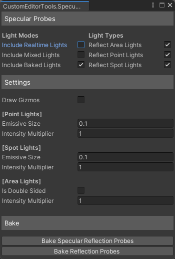

# Unity Specular Probes
A simple editor script that places an emissive object at the place of every light in the scene to emulate specular highlights on reflection probes when baking them.

### Why?
The unity standard shader does not have a specular highlight term when baking lightmaps *(even with directional lightmaps)*. As a result when switching to fully baked lighting within unity, you lose out on the specular highlight term you would normally get from realtime/mixed lights *(unless you are using the shader that computes a specular highlight using the directional term from the lightmap)*. 

This is a script that attempts to alleviate that by spawning an emissive object before reflection probes are baked in an attempt to emulate the specular lobe of the light. All of this at no extra performance cost at all! *(because it's being baked directly into the reflection probes)*.

## Results

Specular Probes Enabled

Specular Probes Disabled

Specular Probes Enabled

Specular Probes Disabled

### Credits
Inspired by [Zulubo's](https://github.com/zulubo/SpecularProbes) implementation, however I opted for my own and went for a more simplified but global solution that also can do area lights as well.
